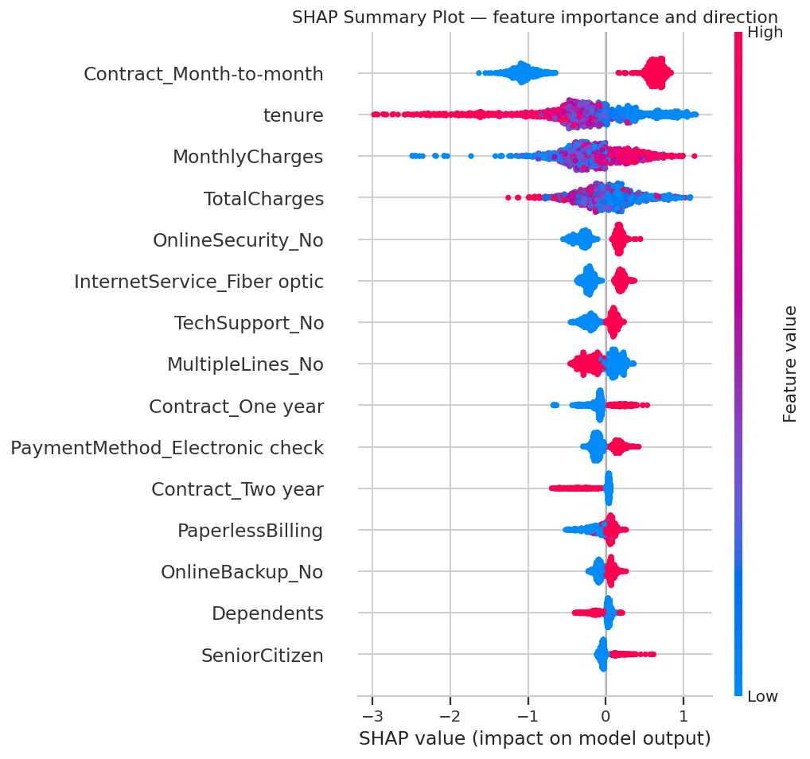

### telcom-customers-churn

Customers prediction for a telecom company

-- which customers are likely to cancel their subcription in the next 30 days? 

--- how do we reduce customers churn?
 

 The formulation in ML variavble:
 Churn = 1 -> customer left within 30 days 
 Churn = 0 -> customer stayed 
This is a binary clssification problem. 

In this case I'm using tje AUC-ROC as the primary metric:
    The dataset has 26% churn and 74% non-churn. This is a class imbalance. If I use plain accuracy, a model that always predict 'non-churn' owuld score 74% - useless, but numerically impressive. AUC-ROC measures the model's ability to rank churners above non-churners across all decision thresholds, making it robust to class imbalance. 
The Precision-Recall at a threshold of 0.4 as secondary metric: 
     Because of we want to catch as many real churners as possible (recall), but we can't call every single customer, by setting the threshold at 0.4 rather than the default 0.4 because in this business context, a missed churner is more expensive than a false alarm. 

Target: 
    AUC-ROC > 0.82 on the held-out test set


# Problem Statement — Customer Churn Prediction

**Version:** 1.0  
**Status:** Draft — pending stakeholder sign-off before Phase 2

---

## 1. Business Question

A telecom company is losing customers at a rate of ~5% per month. The retention team needs to know, in advance, which customers are likely to cancel so they can intervene with a targeted offer before the customer leaves.

**Core question:** Given a customer's current usage, contract, and billing data, what is the probability that they will cancel their subscription within the next 30 days?

---

## 2. ML Problem Type

This is a **supervised binary classification** problem.

- `Churn = 1` → customer cancelled within 30 days
- `Churn = 0` → customer stayed

---

## 3. Evaluation Metric

**Primary metric:** AUC-ROC  
**Target:** AUC-ROC ≥ 0.82 on the held-out test set

**Why AUC-ROC and not accuracy?**  
The dataset has a class imbalance (~26% churn, ~74% no churn). A model that always predicts "no churn" would score 74% accuracy while being completely useless. AUC-ROC measures the model's ability to rank churners above non-churners across all decision thresholds, making it robust to imbalance.

**Secondary metric:** Precision and Recall at a decision threshold of 0.4  
The threshold is set below 0.5 because missing a real churner (false negative) is more costly to the business than flagging a non-churner for a retention offer (false positive).

---

## 4. Business Value

| Item | Value |
|---|---|
| Monthly customer base | ~7,043 |
| Estimated monthly churn | ~352 customers (~5%) |
| Avg. monthly revenue per customer | ~$65 |
| Monthly revenue lost to churn | ~$22,880 |
| Cost to retain vs. acquire | 5× cheaper to retain |
| Projected monthly saving (model at 40% recovery) | ~$4,576 |

A model that flags the highest-risk customers each week, enabling the retention team to make targeted offers, is estimated to recover ~$4,576/month in otherwise lost revenue.

---

## 5. Constraints & Assumptions

**Capacity:** The retention team can act on a maximum of 500 flagged customers per month. The model output must be a ranked list by churn probability, not a flat binary prediction.

**Explainability:** Predictions must be explainable to non-technical managers. SHAP values will be generated for every high-risk customer flagged.

**Retraining:** Customer behaviour shifts over time due to promotions, price changes, and competitor actions. The model must be retrained monthly on fresh data.

**Data scope:** The model uses only data available at prediction time — no future data leakage. Features are derived from billing, contract, and service usage records.

---

## 6. Ethical Considerations

The dataset contains the features `gender` and `SeniorCitizen`. Before deployment, model performance (precision, recall) will be evaluated separately across these groups to check for discriminatory behaviour. If significant disparity is found, these features will be excluded from training.

---

## 7. Definition of Done

The project is considered successful when:

1. A trained model achieves AUC-ROC ≥ 0.82 on the held-out test set.
2. SHAP explanations are generated and interpretable for the top 10 most important features.
3. A REST API endpoint accepts customer feature data and returns a churn probability score.
4. A monthly retraining schedule is documented.
5. A model card is written summarising performance, limitations, and fairness checks.

---

## 8. Dataset

**Source:** IBM Telco Customer Churn (publicly available on Kaggle)  
**Size:** 7,043 rows × 21 columns  
**Target column:** `Churn` (Yes/No → encoded as 1/0)


 
---

## Results summary

| Model | AUC-ROC | Notes |
|---|---|---|
| Dummy (baseline) | 0.500 | Always predicts majority class |
| Logistic Regression | 0.825 | Good interpretable reference |
| Random Forest | 0.838 | Captures non-linearities |
| **XGBoost (selected)** | **0.843** | Best performance, lowest variance |

---

## Key findings (SHAP explainability)

The model identifies the highest-risk customer profile as:

> Month-to-month contract + tenure < 12 months + high monthly charges
> + no online security or tech support add-ons

These customers churn at ~47% — nearly double the overall rate of 26.5%.



---


## Live demo

The model is deployed as a REST API.

**API base URL:** https://churn-api-xxxx.onrender.com  
**Interactive docs:** https://churn-api-xxxx.onrender.com/docs  

### Quick test

```bash
curl -X POST "https://churn-api-xxxx.onrender.com/predict" \
     -H "Content-Type: application/json" \
     -d '{"tenure": 5, "MonthlyCharges": 85.5, ...}'
```

**Example response:**
```json
{
  "churn_probability": 0.8134,
  "churn_risk": "High",
  "recommendation": "PRIORITY — Immediate outreach recommended..."
}
```
# Customer Churn Prediction

An end-to-end machine learning project predicting telecom customer churn,
from business problem definition through model deployment and monitoring.

**Live API:** https://churn-api-xxxx.onrender.com  
**Interactive docs:** https://churn-api-xxxx.onrender.com/docs

---

## Project overview

**Business problem:** A telecom company loses ~26% of customers annually
to churn. This project builds a system to identify high-risk customers
30 days before they leave, enabling the retention team to intervene.

**Solution:** XGBoost classifier served via a FastAPI REST API, containerised
with Docker, deployed to Render, with Evidently AI drift monitoring.

**Result:** AUC-ROC 0.843 on held-out test data (vs 0.500 baseline).
Estimated monthly net benefit: ~$4,500 after retention offer costs.

---

## Results summary

| Model | AUC-ROC | Notes |
|---|---|---|
| Dummy (baseline) | 0.500 | Always predicts majority class |
| Logistic Regression | 0.825 | Good interpretable reference |
| Random Forest | 0.838 | Captures non-linearities |
| **XGBoost (selected)** | **0.843** | Best performance, lowest variance |

---

## Key findings (SHAP explainability)

The model identifies the highest-risk customer profile as:

> Month-to-month contract + tenure < 12 months + high monthly charges
> + no online security or tech support add-ons

These customers churn at ~47% — nearly double the overall rate of 26.5%.


---


## Tech stack

| Category | Tools |
|---|---|
| Analysis | pandas, numpy, matplotlib, seaborn |
| Modelling | scikit-learn, xgboost, imbalanced-learn |
| Explainability | shap |
| Deployment | fastapi, uvicorn, docker |
| Hosting | Render (free tier) |
| Monitoring | evidently |

---

## Run locally

```bash
git clone https://github.com/gregangel1550-del/customer-churn-prediction
cd customer-churn-prediction

# Option A — run notebooks
pip install -r api/requirements.txt
jupyter notebook

# Option B — run the API with Docker
docker build -t churn-api .
docker run -p 8000:8000 churn-api
# Open http://localhost:8000/docs
```

---

## Documentation

- [Problem statement](docs/problem_statement.md)
- [Model card](docs/model_card.md)
- [Drift report](docs/monitoring/drift_report.html)

---

## Project structure

```

customer-churn-prediction/
├── api/
│   ├── main.py
│   ├── schema.py
│   ├── predict.py
│   └── requirements.txt
├── data/
│   ├── WA_Fn-UseC_-Telco-Customer-Churn.csv
│   └── processed/
│       ├── X_train.npy / y_train.npy
│       ├── X_val.npy   / y_val.npy
│       └── X_test.npy  / y_test.npy
├── docs/
│   ├── problem_statement.md
│   ├── model_card.md
│   └── figures/
│       ├── 01_churn_distribution.png
│       ├── 02_numeric_distributions.png
│       ├── 03_categorical_churn_rates.png
│       ├── 04_correlation_heatmap.png
│       ├── 05_split_balance.png
│       ├── 06_model_comparison.png
│       ├── 07_confusion_matrix.png
│       ├── 08_roc_curve.png
│       ├── 09_precision_recall.png
│       ├── 10_shap_summary.png
│       ├── 11_shap_bar.png
│       ├── 12_shap_waterfall_highrisk.png
│       ├── 13_shap_waterfall_lowrisk.png
│       └── 14_shap_dependence_tenure.png
├── models/
│   ├── preprocessor.pkl
│   └── xgb_churn_model.pkl
├── notebooks/
│   ├── 00_problem_framing.ipynb
│   ├── 01_eda.ipynb
│   ├── 02_feature_engineering.ipynb
│   ├── 03_modeling.ipynb
│   └── 04_evaluation.ipynb
├── Dockerfile
├── .dockerignore
└── README.md
```